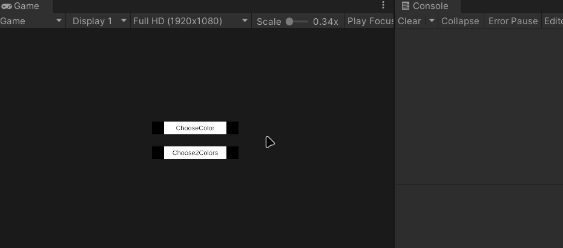

# HyPack.SimpleDialog
 Simple extendable dialog module for Unity

## Demo Preview
- Basic
- Advance

## Install
- Depends on UniRx (please preinstall to your project)
  - [Github](https://github.com/neuecc/UniRx)
  - [AssetStore](https://assetstore.unity.com/packages/tools/integration/unirx-reactive-extensions-for-unity-17276) 
-  Import .unitypackage in "HyPack.SimpleDialog/Unitypackage/"

## Setup 
1. Makesure "HyPack/SimpleDialog/SimpleDialog.prefab" exist in scene
2. Makesure necessary CustomDialogTemplatePrafab has ref by "HyPack/SimpleDialog/DialogRepoSettings.asset"
3. Then, you can call custom dialog like `CustomUI_Basic.cs(CheckDemoScene)`

### Create your DialogTemplatePrafab(WithScript)
- Check "Demo" folder, you can design custom layout UI prefabs like contents of "Prefabs_DialogTemplates" folder
- Makesure necessary components & hierarchy gameobject
  - OverlayBackgroundPanel
  - DialogContainerPanel
  - TitleText & MessageText
  - OneFooterButtonSample & BottonsLayoutGroup
  - {Custom components} (Optional)
- Create specific dialog script inherit `IDialog` to control dialog local logic, asign to prefab
- If dialog has args or context(data container), declare class(`Context:IDialogContext`) and member variable in your `DialogClass`, and implement GetContext() to return it.

### Create your DialogHelper(GlobleHandler)
- Create static class to declare dialog behaviour like scripts in "Demo/CustomUtils/"
- Example:
  ``` C#
  using UnityEngine;
  using HyPack;

    // Create custom dialog intermediary for project
    public static class CustomBasicDialogHelper
    {
        public static void ShowDialog_SayHi()
        {
            var d = SimpleDialog.GetDialogInstance<BasicDialog>("", "Hi");
            d.SetButtonQty(0);
            d.useOverlayToClose = true;
            d.AddOverlayClickAction(() => Debug.Log("OverlayPanel Clicked!"));
        }
    }
  ```
- Through the `CustomDialogHelper`, you can call the dialog box anywhere in the project
